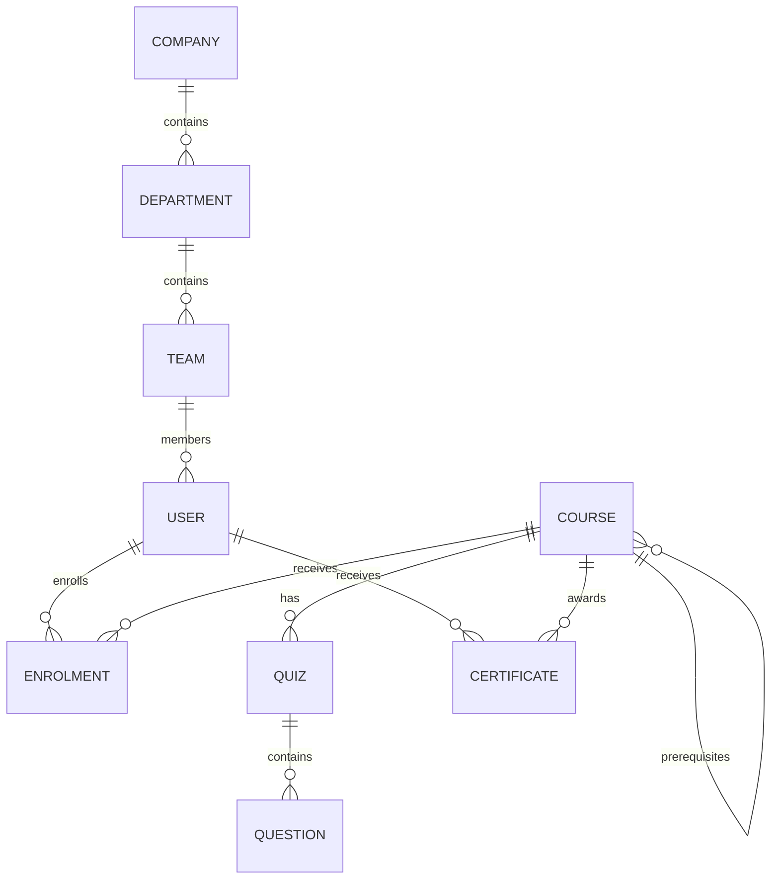
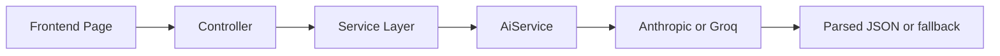
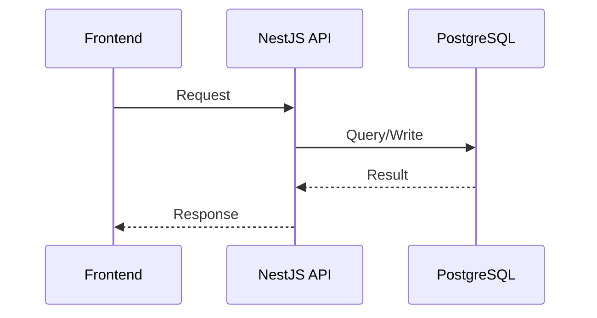

# SkillForge Architecture Report

## 1. Entity-Relationship (ER) Diagram

SkillForge is a role-based corporate learning platform with relational entities for users, organizations, training content, enrolments, quizzes, and certificates.

### ER Diagram



### Key Entities

- User: employee, manager, content admin, or HR admin
- Company / Department / Team: organization hierarchy
- Course: training content with metadata and versions
- Enrolment: links a user to a course and tracks completion
- Quiz / Question: assessment content for courses
- Certificate: issued after course completion

## 2. API Contract

The backend is a NestJS REST API with JWT authentication and role-based authorization.

| Route | Method | Auth | Roles | Notes |
|---|---|---|---|---|
| /auth/login | POST | Public | None | Login and issue tokens |
| /auth/register | POST | Public | None | Register employee account |
| /auth/refresh | POST | Public | None | Refresh tokens |
| /auth/profile | GET | JWT | Authenticated user | Get user profile |
| /users | GET | JWT | HR_ADMIN, MANAGER | List users |
| /courses | GET | JWT | Authenticated user | List courses |
| /enrolments/self | POST | JWT | EMPLOYEE, MANAGER, CONTENT_ADMIN, HR_ADMIN | Self-enrol |
| /learning-path/recommend | POST | JWT | Authenticated user | AI or fallback recommendation |
| /quiz-generator/:courseId/generate | POST | JWT | CONTENT_ADMIN | Generate quiz from PDF |
| /skill-gap/analyze | POST | JWT | MANAGER, HR_ADMIN | Analyze team skills |
| /compliance/team | GET | JWT | MANAGER | Team compliance |
| /compliance/company | GET | JWT | HR_ADMIN | Company compliance |
| /certificates/verify/:code | GET | Public | None | Verify certificate |

## 3. React Component Tree

The frontend uses React Router with a protected app shell and role-gated pages.

```text
App
├── /login
├── /register
├── /verify/:code
└── /app (ProtectedRoute)
    ├── HomePage
    ├── CataloguePage
    ├── MyCoursesPage
    ├── LearningPathPage
    ├── CertificatesPage
    ├── QuizPage
    ├── ManageCoursesPage (CONTENT_ADMIN)
    ├── BulkEnrolPage (MANAGER)
    ├── TeamCompliancePage (MANAGER)
    ├── CompanyCompliancePage (HR_ADMIN)
    ├── SkillGapPage (MANAGER, HR_ADMIN)
    ├── QuizGeneratorPage (CONTENT_ADMIN)
    └── ComplianceAlerterPage (HR_ADMIN)
```

## 4. AI Integration Architecture

AI features are implemented on the backend through a central AiService.

### Flow



### AI Modules

- Learning path recommendation
- Quiz generation from uploaded PDFs
- Skill-gap analysis
- Compliance alert drafting

## 5. Authentication and Authorization

- Login uses email/password with JWT access and refresh tokens
- Passwords are hashed with bcrypt
- JwtAuthGuard validates the bearer token
- RolesGuard enforces role-based route access

## 6. Database Flow

The request flow is:

Frontend → API Controller → Service → TypeORM Repository → PostgreSQL



## 7. Folder Structure

```text
Skill-forge/
├── backend/
│   └── src/
│       ├── ai/
│       ├── auth/
│       ├── courses/
│       ├── quizzes/
│       ├── compliance/
│       ├── users/
│       └── ...
├── frontend/
│   └── src/
│       ├── components/
│       ├── pages/
│       ├── store/
│       └── lib/
```

## 8. Architecture Summary

SkillForge uses a modular monolith architecture with NestJS for backend services, React/Vite for the frontend, TypeORM for database access, and JWT-based auth with role-based access control.
